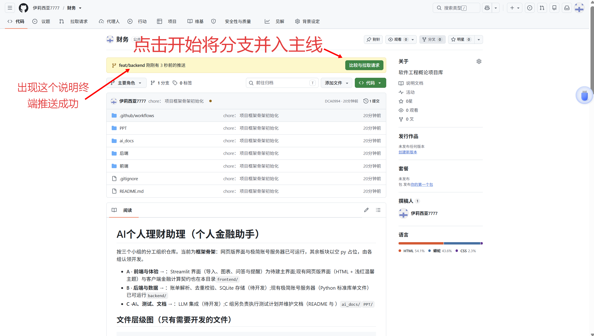
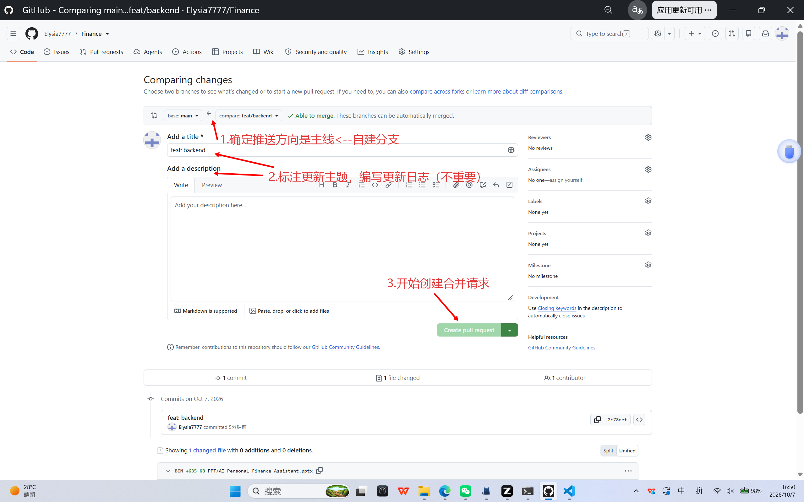
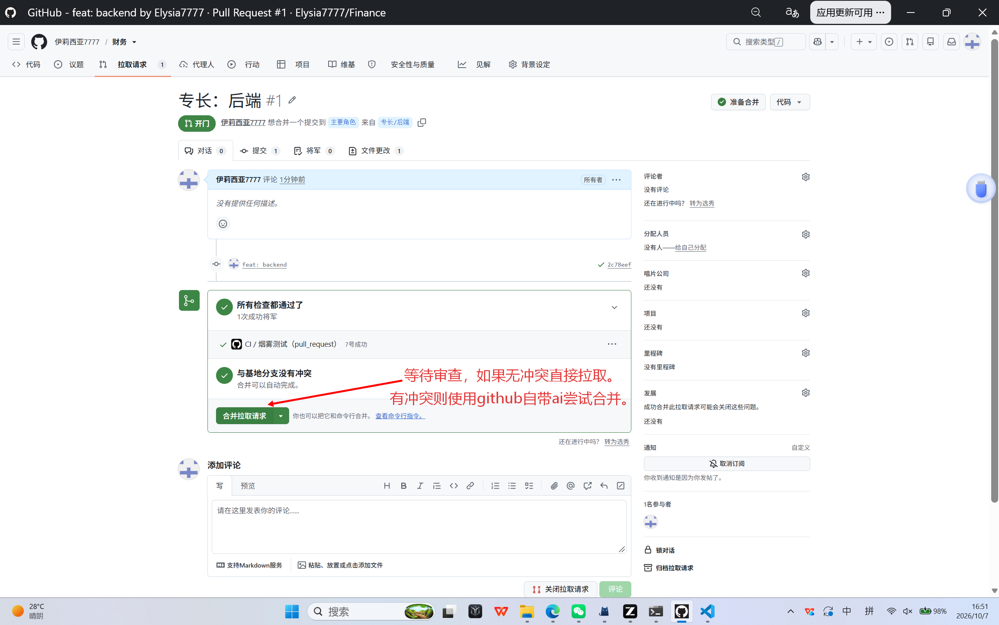

# AI Personal Finance Assistant（个人金融助手）

按三个小组的分工组织仓库。当前为**框架骨架**：网页版界面与极简账号服务器已可运行，其余板块以空 py 占位，由各组认领开发。

- **A · 前端与体验** → `frontend/`：Streamlit 界面（导入、图表、问答与提醒）为待建主界面；现有网页版界面（HTML + 浅红温馨主题）与客户端金融计算契约也在本目录
- **B · 后端与数据** → `backend/`：账单解析、去重校验、SQLite 存储（待开发）；现有极简账号服务器（Python 标准库单文件）已可运行
- **C · AI、测试、文档** → `ai_docs/`：LLM 集成（待开发）；C 组另负责执行测试计划并维护文档（README 与 `PPT/`）

## 文件层级图（只有需要开发的文件）

```
Finance/
├── README.md                 # 本文件：三组分工、层级图、待开发功能、快速开始、GitHub 开发全流程
├── .gitignore                # 排除运行时数据（backend/db.json、*.db）、编译产物等
├── .github/workflows/ci.yml  # GitHub Actions：语法检查 + 服务器冒烟 + 计算契约自测
├── frontend/                 # 【A · 前端与体验】
│   ├── app.py                # 🚧 Streamlit 主界面（占位）：导入 / 图表 / 问答 / 提醒 四大板块待实现
│   ├── index.html            # ✅ 网页版主界面（单文件）：顶栏账号管理与主体设置 / 右侧三板块 / 主区项目列表
│   ├── theme.css             # ✅ 网页版 UI 主题：浅红温馨风（默认）；🚧 主题切换与更多主题待开发
│   └── finance_calc.py       # 🚧 客户端金融计算契约：组合估值 / 汇率换算 / 收益统计（函数签名即契约）
├── backend/                  # 【B · 后端与数据】
│   ├── server.py             # ✅ 极简账号服务器：注册/登录/登出 + 账号信息接口 + 板块占位接口 + 页面托管
│   │                         # 🚧 待开发：账号资料修改、项目内容增删改查、设置持久化（现为 501 占位）
│   ├── panels.json           # 右侧板块（股票/货币/贵金属）占位数据；🚧 待接入真实行情
│   ├── bill_parser.py        # 🚧 账单解析（空占位）：CSV/Excel 账单 → 统一流水记录
│   ├── dedup.py              # 🚧 去重校验（空占位）：流水去重与冲突处理
│   └── storage.py            # 🚧 SQLite 存储（空占位）：表结构设计与读写（当前账号数据为 JSON 文件）
└── ai_docs/                  # 【C · AI、测试、文档】
    └── llm_client.py         # 🚧 LLM 集成（空占位）：流水问答、消费提醒生成
```

> `PPT/` 为团队已有资料（提案大纲、风险与测试计划等），不属开发代码，不在图中展开。

## 待开发功能清单（按组认领）

| 组 | 功能 | 位置 | 说明 |
|---|---|---|---|
| A | Streamlit 界面 | `frontend/app.py` | 四大板块：导入（账单上传）、图表（消费分析）、问答（AI 对话）、提醒 |
| A | 网页版界面与主题 | `frontend/index.html`、`theme.css` | 已实现浅红温馨主题；主题切换与更多主题待开发 |
| A | 金融计算 | `frontend/finance_calc.py` | 组合估值、汇率换算、收益统计（在客户端执行） |
| B | 账单解析 | `backend/bill_parser.py` | 导入账单 → 统一流水记录（契约草案见文件注释） |
| B | 去重校验 | `backend/dedup.py` | 流水去重与冲突处理 |
| B | SQLite 存储 | `backend/storage.py` | 表结构设计与读写；与 server.py 的 JSON 存储并存或迁移 |
| B | 账号体系增强 | `backend/server.py` | 资料修改、项目增删改查、设置持久化（501 占位） |
| B | 行情数据 | `backend/panels.json` | 股票/货币/贵金属真实行情接入 |
| C | LLM 集成 | `ai_docs/llm_client.py` | 流水问答、提醒生成；模型选型与 Prompt 设计 |
| C | 测试与文档 | 仓库各处 + `PPT/` | 执行测试计划；维护 README 与团队文档 |

## 快速开始

要求：Python ≥ 3.10（无需安装任何第三方库）。

```bash
python backend/server.py    # 启动账号服务器（同时托管网页版界面）
```

浏览器打开 <http://127.0.0.1:8000>：顶栏「登录 / 注册」注册账号后即可查看完整布局。
Streamlit 界面为 A 组待建项，实现后运行方式：`pip install streamlit` → `streamlit run frontend/app.py`。

## GitHub 开发全流程


### 第一次：新成员加入（每人只需一次）

```bash

# 0. 设置代理（假设梯子端口是7890）
git config --global http.proxy http://127.0.0.1:7890
git config --global https.proxy http://127.0.0.1:7890

# 1. 克隆仓库并进入目录
git clone https://github.com/Elysia7777/Finance.git
cd Finance

# 2. 首次使用 Git 需配置身份（--global 全局只需配一次）
git config --global user.name "你的名字"
git config --global user.email "你的邮箱"

# 3. 本地运行验证
python backend/server.py          # 浏览器打开 http://127.0.0.1:8000
python frontend/finance_calc.py   # 金融计算契约自测
```

### 后续：日常开发循环（GitHub Flow，每个功能重复一次）

```bash
# 1. 每次开始前：同步主干最新代码
git checkout main
git pull origin main

# 2. 从 main 新建功能分支（前缀约定：feat/ 新功能、fix/ 修缺陷、docs/ 文档）
git checkout -b feat/xxx
#或者切换到已有分支
git checkout feat/xxx

# 3. 开发 → 提交（可多次）
git add "改动的文件"
git commit -m "feat: xxx"

# 4. 推送分支到 GitHub（首次推送加 -u 建立关联，之后直接 git push）
git push -u origin feat/xxx

# 5. 发起 Pull Request 并合并
#    网页方式：推送后仓库页面会出现 “Compare & pull request” 提示，
#    或 Pull requests → New pull request（base: main ← compare: feat/xxx），
#    填写说明后创建 PR，至少一人 Review 通过后点击 Merge

# 6. 合并后回到主干同步，删除已完成分支（不删也可以）
git checkout main
git pull origin main
git branch -d feat/xxx
git push origin --delete feat/xxx
```
<p align="center">
  
  
  
</p>
### 文件删除方式：（不建议直接在主线修改文件。这个部分尽量少用）

```bash
# 1. 先切回 main 并同步，确保确保本地 main 和云端一致
git checkout main
git pull origin main

# 2. 删除文件（举例PPT\Risks_Tests_Team_Plan_CN.pptx和PPT\Risks_Tests，Team_Plan.pptx）
git rm "PPT\Risks_Tests_Team_Plan_CN.pptx" "PPT\Risks_Tests，Team_Plan.pptx"
#注意空格
git commit -m "chore: 删除第三部分PPT"
git push origin main
#git rm 会同时从工作区删除文件，并把这个删除加入暂存区。


### 协作约定

- `backend/db.json` 为运行时账号数据（已 gitignore），**不要提交**；如需重置本地数据直接删除该文件
- `.gitignore` 用来确定那些文件不能上传